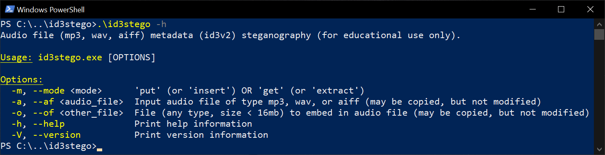
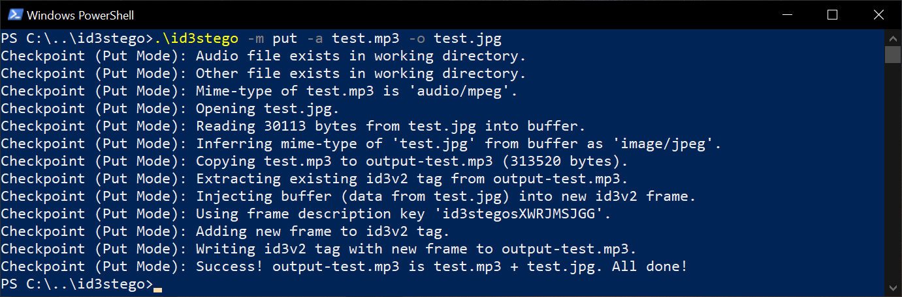
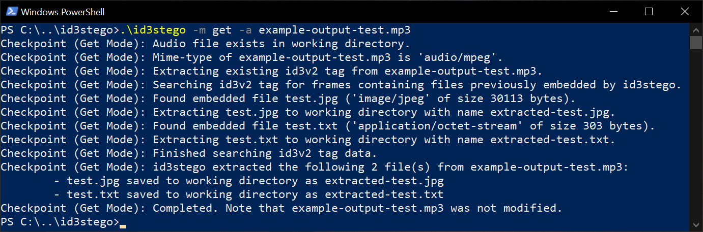

# id3stego v0.1

id3stego is a simple command line utility for demonstrating audio file metadata insertion steganography.  It embeds (and extracts) any other file (any type, size <= 16mb) into an mp3, wav, or aiff file's id3v2 metadata.  

## Use Restriction (Educational Use Only)

id3stego is intended and released solely for educational use, which use must comply with all applicable laws, rules, and regulations. id3stego may not be used for any other purpose. The included license is hereby amended to incorporate this restriction. 

## Getting Started 
* Download [id3stego's Latest Release](https://github.com/FrozenBurrito/id3stego/releases/download/v0.1.0/id3stego.exe) (Windows 64-bit).
* Also available in this repo's sidebar under 'Releases.'

## Usage and Examples (Windows Powershell)

### General Usage Info
```
.\id3stego -h
```


### **Put (Insert) Mode**
```
.\id3stego -m put -a [audio_file] -o [other_file]
```


### **Get (Extract) Mode**
```
.\id3stego -m get -a [audio_file]
```


## Description & More Info

I wrote id3stego to help me to get better at [Rust](https://doc.rust-lang.org/stable/rust-by-example/)! I also hopes it helps my students to learn more about steganography! Here's the details:
* **Put Mode** (ex: .\id3stego -m put -a test.mp3 -o test.jpg)
    * specified audio file (ex: -a test.mp3) and specified other file (-o test.jpg) must be in same working directory as id3stego.exe
    * embeds other file (ex: -o test.jpg) into audio file's (ex: -a test.mp3) id3v2 metadata
        * uses id3v2 general encapsulated objects ("GEOB")
    * sets frame description key to id3stego + 10 random characters (used for 'get'/'extract' mode)
    * maximum embedded file size is 16mb (max id3v2 frame size)
    * output audio file (test.mp3 + test.jpg) saved to working directory with filename prefix 'output-'
        * ex: output-test.mp3
    * does NOT modify audio file (ex: -a test.mp3) or other file (-o test.jpg)
    * can embed multiple files into one audio file, but current version requires multiple put mode executions
        * ex step 1: .\id3stego -m put -a test.mp3 -o test.jpg
            * creates output-test.mp3 (test.mp3 + test.jpg)
        * ex step 2: .\id3stego -m put -a output-test.mp3 -o test.txt
            * creates output-output.test.mp3 (test.mp3 + test.jpg + test.txt)
* **Get Mode** (ex: .\id3stego -m get -a example-output-test.mp3)
    * specified audio file (ex: -a test.mp3) must be in same working directory as id3stego.exe
    * extracts all files previously embedded by id3stego from audio file's (ex: -a output-test.mp3) id3v2 metadata
        * uses frame description key to search audio file (ex: -a output-test.mp3)
    * saves extracted files to working directory with filename prefix 'extracted-'
        * ex: test.jpg saved as extracted-test.jpg
        * ex: test.txt saved as extracted-test.txt
    * does NOT modify audio file (ex: -a output-test.mp3)
* Note about verbosity
    * Verbose checkpoint and error handling (to help me learn Rust, '? expanded to match)
    * There is probably a more idiomatic and less verbose way to handle error propagation and messages (custom error types?).  May revisit this as I learn more Rust.
* Demonstrates a weak form of insertion steganography.
    * As an extension activity for interested students, try using a different utility to dump and investigate all id3v2 metadata.

## What if I want to build id3stego myself?

Building id3stego is easy.  
* First, download and install [rustup](https://www.rust-lang.org/tools/install) (rust build tools manager)
    * Release v0.1.0 was built with `rustc 1.65.0 (897e37553 2022-11-02)'
* Recommend using [Visual Studio Code](https://code.visualstudio.com/download) with [rust-analyzer extension](https://code.visualstudio.com/docs/languages/rust).
* Next, from a Developer Powershell for VS terminal or a Visual Studio Code Powershell terminal, try: 
```
git clone https://github.com/FrozenBurrito/id3stego.git 
cd id3stego
cargo build
```
* Or, try: 
```
git clone https://github.com/FrozenBurrito/id3stego.git 
cd id3stego
cargo run -- -h
```
* To test 'get' mode with the included example, try:
```
cargo run -- -m get -a example-output-test.mp3
```

## Suggestions or Contributions

Let me know if you have any questions or suggestions!  Please feel free to contribute.

## Authors

Jon Morris, [frozenburrito](https://github.com/frozenburrito)

## Version History
* 0.1
    * It works!

## Future Features or Changes (To Do List)

* (minor) Add support for embedding multiple other files with one 'put' mode execution
* (minor) Add custom frame description keys set by users with '-k' option 
    * id3stego uses the frame description key to search for and extract embedded frames containing file data
    * in v0.1, frame description key set as id3stego + 10 random chars to avoid collisions when embedding multiple files 
* (minor) Add option to set output file name (or output file name prefix)
* (minor) Add option to strip (remove) all embedded files from input audio file in 'get' mode ('-s' flag)
    * Current version does not modify audio file in 'get' mode 
* (minor) Linux build and release
* (minor/patch) Add check for tag size > 256mb, instead of relying on error propagation
* (minor/patch) Add pre-check re whether audio file (ex: -a test.mp3) and specified other file (-o test.jpg) are in same working directory as id3stego.exe (or alternatives, e.g., output file pre-fix --> postfix + ensuring full path is not used to write output and extracted files)
* (major) Add support for other files of size > 16mb (max id3v2 frame size) by embedding data into multiple frames (note: id3v2 tag size of 256mb)
* (major) GUI -- immediate mode GUIs, like [egui](https://github.com/emilk/egui), are cool!

## License

This project is licensed under the MIT License.  See the LICENSE.md file for details.

## Helpful Links

* [relevant part of id3v2 specification](https://id3.org/id3v2.3.0#General_encapsulated_object)
* [id3v2 made easy](https://id3lib.sourceforge.net/id3/easy.html)
    * Note maximum id3v2 tag size of 256mb and frame size of 16mb.
* [NASA's copyright-free audio](https://www.nasa.gov/connect/sounds/index.html) 
    * test.mp3 = http://www.nasa.gov/mp3/584791main_spookysaturn.mp3 (Cassini Mission, Saturn Radio Emissions)
* [NASA's copyright-free images](https://images.nasa.gov/) 
    * test.jpg = https://images.nasa.gov/details-art001e002065
* ["Public Domain Expansion 2022: Highlights of the Harlem Renaissance"](https://cdlib.org/cdlinfo/2022/02/14/public-domain-expansion-2022-highlights-of-the-harlem-renaissance-and-modernist-writers-in-hathitrusts-newly-opened-volumes/) 
    * test.txt = Langston Hughes' "The Dream Keeper" from *The Weary Blues* (1926)
* [Setting Default Powershell Prompt](https://learn.microsoft.com/en-us/powershell/module/microsoft.powershell.core/about/about_prompts?view=powershell-7.3) 
    * Helpful for masking local directory sturcture shown on prompt before creating usage screenshots
* [Ryan Levick's Introduction to Rust on Youtube (2 Parts)](https://www.youtube.com/watch?v=WnWGO-tLtLA)

## Helpful Rust Crates (Libraries)

* [rust-id3](https://docs.rs/id3/latest/id3/)
* [clap](https://docs.rs/clap/latest/clap/)
* [infer](https://crates.io/crates/infer)
